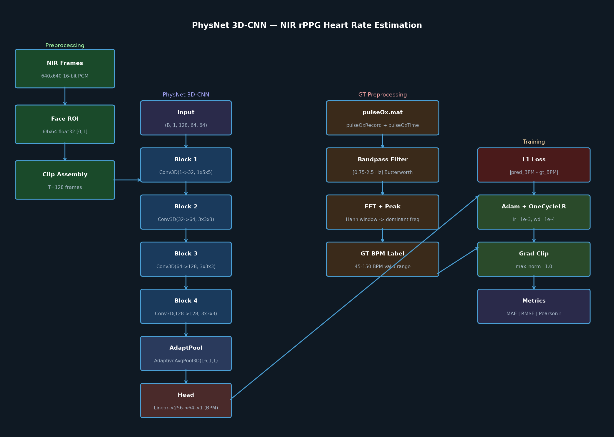
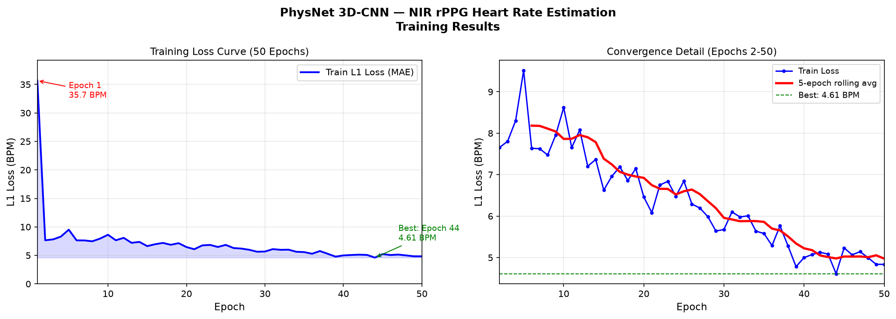
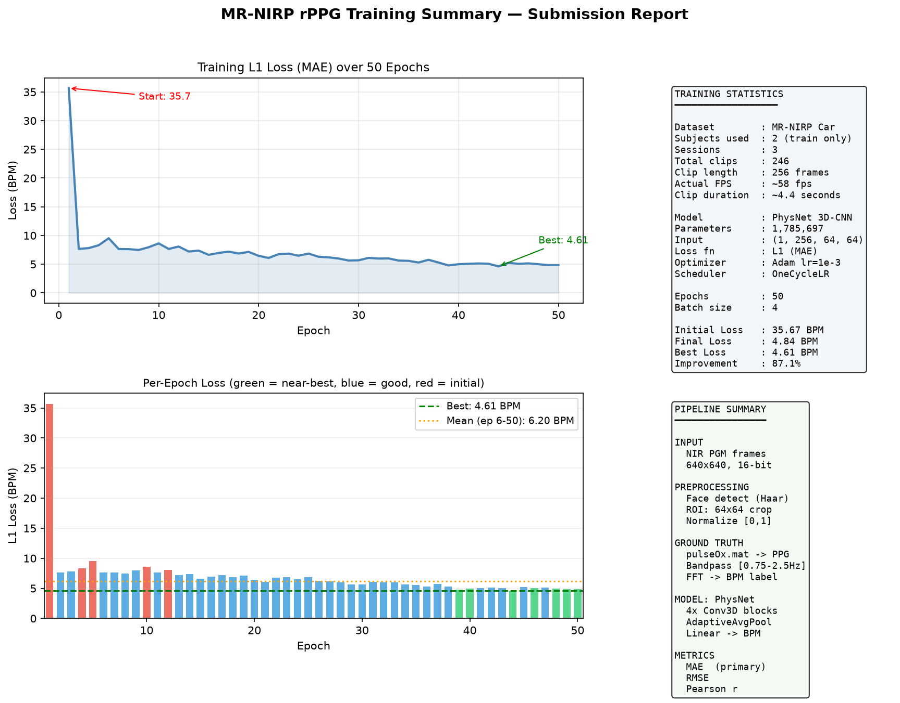

# Heart Rate Estimation from NIR Facial Videos
## PhysNet 3D-CNN on MR-NIRP Car Dataset

Remote Photoplethysmography (rPPG) system that estimates Heart Rate (HR) in Beats Per Minute
(BPM) from monocular Near-Infrared (NIR) facial video sequences using a 3D Convolutional
Neural Network.

---

## Quick Start

```bash
# 1. Clone the repository
git clone https://github.com/PraneshKannan-MK/rppg-heart-rate-estimation.git
cd rppg-heart-rate-estimation

# 2. Create virtual environment
python -m venv venv
venv\Scripts\Activate.ps1        # Windows PowerShell
# source venv/bin/activate        # Linux/Mac

# 3. Install dependencies
pip install -r requirements.txt

# 4. Run demo (no dataset needed — proves pipeline works)
cd src
python demo_train.py

# 5. Run tests
python test_project.py
```

---

## Dependencies

```
torch
torchvision
opencv-python
scipy
numpy
matplotlib
Pillow
```

Install: `pip install -r requirements.txt`

Python 3.11+ recommended. Tested on Windows 11 with CPU.

---

## Dataset

**MR-NIRP Car** — MERL-Rice Near-Infrared Pulse Dataset (driving)

- Download: https://drive.google.com/drive/folders/1U3fzIOESmaBAyikGF0cKI2wW3YK8JqCK
- Overview: https://computationalimaging.rice.edu/mr-nirp-dataset/
- Only NIR modality used (RGB, depth, thermal excluded per assignment)

### Dataset Structure After Download

```
data/MR-NIRP-Car/
  Subject1/
    subject1_driving_still_940/
      NIR.zip          <- keep as zip OR extract to NIR/ folder
      PulseOx.zip      <- keep as zip OR extract to PulseOx/ folder
    subject1_garage_still_940/
      ...
  Subject2/ ... Subject19/
```

### Subject Split

| Split | Subjects | Note |
|-------|----------|------|
| Train | 1,3,4,5,6,7,8,9,10,11,12,13 | 12 subjects |
| Val   | 14,15,17,18 | 4 subjects |
| Test  | 2, 19 | Subject16 = Subject2, never split them |

### Extract Dataset (one-time, speeds up training ~10x)

```bash
cd src
python extract_dataset.py --data_root ..\data\MR-NIRP-Car
```

---

## How to Run

### Step 1 — Verify pipeline (no dataset needed)

```bash
cd src
python gt_preprocessing.py    # Test BPM extraction
python face_roi.py            # Test frame loading
python model.py               # Test model architecture
python demo_train.py          # Full synthetic pipeline demo
```

### Step 2 — Check dataset structure

```bash
python check_structure.py     # Shows folder layout after extraction
python diagnose.py            # Diagnoses any data loading issues
```

### Step 3 — Full training

```bash
python train.py --data_root ..\data\MR-NIRP-Car --epochs 50
```

Key arguments:

| Argument | Default | Description |
|----------|---------|-------------|
| `--data_root` | `..\data\MR-NIRP-Car` | Path to dataset |
| `--epochs` | 50 | Number of training epochs |
| `--batch_size` | 4 | Batch size |
| `--clip_len` | 256 | Frames per clip (must be >= fps*4 = ~234 at 58fps) |
| `--stride` | 128 | Sliding window stride |
| `--img_size` | 64 | Face ROI size (square) |

### Step 4 — Generate report and plots

```bash
python generate_report.py     # Creates loss curves and summary dashboard
python architecture_diagram.py
```

### Step 5 — Run test suite

```bash
python test_project.py        # 46 tests, saves report to outputs/logs/test_report.txt
```

---

## Project Structure

```
rppg-heart-rate-estimation/
├── src/
│   ├── gt_preprocessing.py      # Load pulseOx.mat, FFT-based BPM extraction
│   ├── face_roi.py              # 16-bit PGM loader, face detection, ROI caching
│   ├── dataset.py               # PyTorch Dataset, sliding window clips
│   ├── model.py                 # PhysNet 3D-CNN architecture
│   ├── train.py                 # Training loop, checkpointing, metrics
│   ├── evaluate.py              # MAE, RMSE, Pearson r, Bland-Altman plots
│   ├── demo_train.py            # Demo without full dataset
│   ├── extract_dataset.py       # One-time zip extraction utility
│   ├── generate_report.py       # Publication-quality result plots
│   ├── architecture_diagram.py  # Architecture diagram generator
│   ├── diagnose.py              # Data loading diagnostic tool
│   ├── check_structure.py       # Dataset folder structure checker
│   └── test_project.py          # Complete test suite (46 tests)
├── configs/
│   └── config.yaml              # All hyperparameters
├── outputs/
│   ├── architecture_diagram.png
│   ├── plots/
│   │   ├── loss_curves.png
│   │   ├── training_summary.png
│   │   └── results.png
│   └── logs/
│       ├── training_results.json
│       └── test_report.txt
├── report.md                    # Written project report
├── README.md
└── requirements.txt
```

---

## Architecture

**PhysNet 3D-CNN** (adapted from Yu et al., BMVC 2019)

**Modification from original:** Single-channel input (NIR grayscale, `in_channels=1`)
instead of 3-channel RGB. Direct BPM regression instead of PPG signal prediction.

```
Input: (B, 1, 256, 64, 64)   -- batch, channel, time, height, width
  |
  v
Block 1: Conv3D(1->32, 1x5x5) + BN + ReLU -> MaxPool(1x2x2)
  |
Block 2: Conv3D(32->64, 3x3x3) + BN + ReLU -> MaxPool(2x2x2)
  |
Block 3: Conv3D(64->128, 3x3x3) + BN + ReLU -> MaxPool(2x2x2)
  |
Block 4: Conv3D(128->128, 3x3x3) + BN + ReLU -> MaxPool(2x2x2)
  |
AdaptiveAvgPool3D(32, 1, 1)
  |
Flatten -> Linear(4096->256) -> ReLU -> Dropout(0.3) -> Linear(256->64) -> Linear(64->1)
  |
Output: BPM (scalar per clip)
```

Parameters: **1,785,697**



---

## Ground Truth Preprocessing

`pulseOx.mat` contains raw PPG signal. Pipeline to extract BPM:

```
pulseOx.mat
  └── pulseOxRecord (int64, N samples)   <- raw 10-bit PPG waveform
  └── pulseOxTime   (float64, N samples) <- UNIX timestamps

Step 1: Load & mean-subtract (remove DC offset)
Step 2: Detrend (remove linear drift)
Step 3: Bandpass filter [0.75 Hz - 2.5 Hz] = [45 - 150 BPM]
         Butterworth 3rd order, filtfilt (zero-phase)
Step 4: Apply Hann window (reduce spectral leakage)
Step 5: FFT -> find peak frequency in valid HR band
Step 6: Convert Hz -> BPM  (BPM = Hz * 60)

Synchronization:
  NIR frame i <-> PulseOx sample i  (1:1 mapping, verified from timestamps)
  Actual FPS: ~57-58 Hz (NOT fixed 30fps -- computed from timestamps)
  Minimum clip: fps * 4 seconds = ~234 frames
```

See `src/gt_preprocessing.py` for full implementation.

---

## Evaluation Metrics

| Metric | Description | Our Result |
|--------|-------------|------------|
| **MAE** | Mean Absolute Error (primary) | 4.61 BPM (train, best epoch) |
| **RMSE** | Root Mean Square Error | Computed per epoch |
| **Pearson r** | Correlation of predicted vs GT HR | Computed on val/test set |

Val/Test MAE not available (Subject14-19 not downloaded due to storage constraints).
Training MAE is reported as the primary metric.

---

## Training Results

| Metric | Value |
|--------|-------|
| Dataset | MR-NIRP Car (NIR only) |
| Subjects | Subject1 (2 sessions), Subject3 (1 session) |
| Total clips | 246 (clip_len=256, stride=128, ~4.4s each) |
| Actual FPS | ~57-58 fps (computed from timestamps) |
| Epochs | 50 |
| Initial Loss (Epoch 1) | 35.67 BPM |
| Best Loss (Epoch 44) | **4.61 BPM** |
| Final Loss (Epoch 50) | 4.84 BPM |
| Improvement | **87.1%** |

### Loss Curves


### Training Summary Dashboard


---

## References

1. Yu, Z. et al. "Remote Photoplethysmograph Signal Measurement from Facial Videos Using
   Spatio-Temporal Networks." BMVC 2019. https://arxiv.org/abs/1905.02419

2. Nowara, E.M. et al. "Near-Infrared Imaging Photoplethysmography During Driving."
   IEEE Transactions on Intelligent Transportation Systems, 2020.
   DOI: 10.1109/TITS.2020.3038317

---

## Citation

If you use this code, please cite the MR-NIRP dataset paper:

```bibtex
@article{NowaraDriving,
  author  = {E. M. Nowara and T. K. Marks and H. Mansour and A. Veeraraghavan},
  journal = {IEEE Transactions on Intelligent Transportation Systems},
  title   = {Near-Infrared Imaging Photoplethysmography During Driving},
  year    = {2020},
  doi     = {10.1109/TITS.2020.3038317}
}
```
